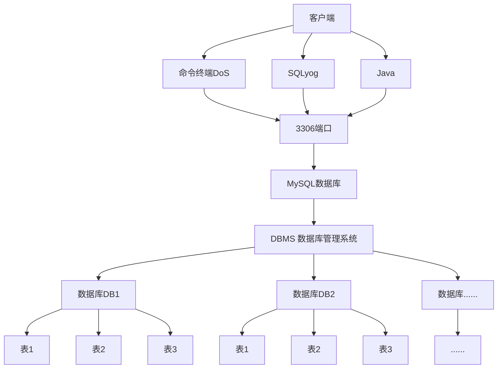

# 省略安装步骤

太麻烦了。建议直接问AI。

如果安装过程出错，重新再来一把：

`sc delete mysql` [删除已经安装好的MYSQL服务 **慎重**]

1. 下载好后，安装到英文和非空格目录下

2. 在系统环境变量中编辑添加bin目录

3. （也要记得添加System32）

4. 在根目录(带bin 的目录)下，新建`my.ini`

5. 写入

    ```ini
    [client]
    port = 3306
    default-character-set=utf8
    [mysqld]
    # 设置为自己MYSQL 的安装目录
    basedir=D:\MySql\mysql-5.7.19-winx64
    # 设置为MYSQL的数据目录
    datadir=D:\MySql\mysql-5.7.19-winx64\data\
    port=3306
    character_set_server=utf8
    bind-address = 0.0.0.0
    skip-ssl
    
    # 跳过安全
    # skip-grant-tables
    
    ```

6. **管理员身份**打开cmd，并且换到bin目录下

    1. `cd /D D:\MySql\mysql-5.7.19-winx64\bin`
    2. `mysqld - install`
    3. `Service successfully installed` 就代表安装成功

7. **初始化数据库** 

    `mysqld --initialize-insecure --user=mysql`

    如果成功会在根目录下生成`data`文件夹

8. 启动MYSQL服务 

    `net start mysql` (net需要添加system32)

    `net stop mysql `停止服务

9. 进入MYSQL管理终端 

    `mysql -u root -p` 当前root用户为空

10. 修改root用户密码

    `use mysql;`

    `update user set authentication_string=password('123456') where user='root' and Host='localhost';`

    注意分号，回车执行命令

    `flush privileges;` 刷新权限

11. 修改my.ini （不跳过安全检查）

     `skip-grant-table` 

12. 重新启动MYSQL服务

     `net stop mysql` `net start mysql`

13. 再次进入MYSQL，输入正确的用户名和密码

     `mysql -u root -p`

     密码正确进入MYSQL

     错误提示如下信息

     `ERROR 1045 (28000):Access denied for user 'root'@'localhost' (using password :NO)`

# 命令行连接到MYSQL

`mysql -h 主机IP -P 端口 -u 用户名 -p密码` 

1. -p密码不要有空格
2. -p后面没有写密码，回车后会要求输入密码
3. 如果没有写-h 主机，默认就是本机
4. 如果没有写-P 端口，默认是3306
5. 实际工作中一般修改默认端口防止黑客轻松攻击。（真能防止吗）


# 安装NaviCat

使用神秘妙妙魔法安装了navicat for MYSQL 后

新建连接 使用选定的端口，用户名，密码 测试链接后连接

新建数据库db01

在db01中新建表

写下字段id name address

保存 设置表名为users

双击users打开表

向其添加三个用户。

这就是表的最基本使用了


# 数据库三层结构

1. 所谓安装Mysql数据库，就是在主机安装一个数据库管理系统（DBMS），这个管理程序可以管理多个数据库，DBMS（database manage system）
2. 一个数据库中可以创建多个表，以保存数据
3. 数据库管理系统，数据库和表的关系如图所示：示意图





数据库-表 的本质仍然是 **文件**


表由行`row` 列 `column` 组成


表的一行称之为**一条记录** 在java程序中，一行记录往往使用对象表示


## SQL语句分类

DDL：数据定义语句`create table,database`

DML:数据操作语句`增加 insert 修改update 删除delete`

DQL:数据查询语句`select`

DCL:数据控制语句[管理数据库]


# 创建数据库

```mysql
CREATE DATABASE [IF NOT EXISTS] db_name

[DEFAULT] CHARACTER SET charset_name
[DEFAULT] COLLATE collation_name
```


1. `line3` 指定数据库采用的字符集,如果不指定字符集,默认utf8
2. `line4` 指定数据库字符集的校对规则(常用的utf8[区分大小写]/`utf8_general_ci` 注意默认是`utf8_general_ci` ) 


练习:

1. 创建一个名称为jl_db01的数据库
2. 创建一个使用utf8字符集的jl_db02的数据库
3. 创建一个使用utf8字符集,并带校对规则的jl_db03数据库


`DROP DATABASE [IF EXISTS] db_name` 慎重删除数据库


```mysql
# 查看所有的数据库
SHOW DATABASES ;
# 查看前面创建的db01 数据库的定义信息
SHOW CREATE DATABASE  jl_db01;
DROP DATABASE jl_db01
```


# 备份 恢复 数据库

DOS:

备份:

`mysqldump -u username -p -B db1 bd2 dbn > D:\\Backupname.sql`

恢复:

前提已经备份了此数据库db1,删除db1后,在dos的MYSQL中,输入 `source D:\\Backupname.sql`


# 创建表

```mysql
# 创建表
CREATE TABLE table_01
(
    field1 datatype,
    field2 datatype,
    field3 datatype,

)character set 字符集 collate 校对规则 engine 存储引擎
```


`field` 指定列名

`datatype` 指定列类型（字段类型）

`character set` 如不指定则为所在数据库字符集

`collate` 如不指定则为所在数据库校对规则

`engine` 引擎（后面单独）


## 创建一个完整的表

其中部分词为关键字，所以建议将字段名用` `` ` 括起来

```mysql
CREATE TABLE `user1` (
	`id` INT,
	`name` VARCHAR ( 255 ),
	`password` VARCHAR ( 255 ),
	`birthday` DATE ) 
CHARACTER SET utf8 
COLLATE utf8_bin 
ENGINE = INNODB;
```


## Mysql列类型-即Mysql的数据类型

## 列类型


1. 数值类型
   1. 整形
      1. `tinyint`[1字节]
      2. `smallint` [2字节]
      3. `mediumint` [3个字节]
      4. `int` [4个字节] **常用**
      5. `bigint` [8个字节]
   2. 小数类型
      1. `float` [单精度 4个字节]
      2. `double` [双精度 8个字节] **常用**
      3. `decimal` [M(整数部分),D(小数部分)] **常用**
2. 文本类型（字符串类型）
   1. `char` [0-255] **常用**
   2. `varchar` [0~2^16-1] **(65535 后同)** **常用**
   3. `text` [0~2^16-1] (部分观点说varchar和text等价) **常用**
   4. `longtext` [0~2^32-1] **(4,294,967,295后同)**
3. 二进制数据类型
   1. `blob` [0~2^16-1]
   2. `longblob` [0~2^32-1]
4. 日期类型
   1. `date` [日期 年月日]
   2. `time` [时间 时分秒]
   3. `datetime` [年月日 时分秒 YYYY-MM-DD HH:MM:SS] **最常用**
   4. `timestamp` [时间戳]
   5. `year` [年] 


```mysql	
# 演示整形
# CREATE TABLE t3 ( id TINYINT );
# CREATE TABLE t4 ( id TINYINT UNSIGNED);
INSERT INTO t3 VALUES (-128); 
SELECT * FROM t3;

INSERT INTO t4 VALUES(255);

```


```mysql
# 演示bit类型使用
# 说明：
# 1. bit(m) m在1-64
# 2. 添加数据 范围
# 3. 显示按照bit的方式
# CREATE TABLE t5 (num BIT(8));
# 4. 查询时，仍然可以按照数来查询
INSERT INTO t5 VALUES(3);
SELECT * FROM t5; 

SELECT * FROM t5 WHERE num = 3;
```


```mysql	
# 演示decimal类型，float double 使用
# 创建表
CREATE TABLE IF NOT EXISTS t6 (
 num1 FLOAT, 
 num2 DOUBLE, 
 num3 DECIMAL ( 30, 20 ) );
# 添加数据
INSERT INTO t6 VALUES( 88.12345678912345, 88.12345678912345, 88.12345678912345 );

SELECT * FROM t6;

CREATE TABLE t7(
num DECIMAL(65));
INSERT INTO t7 VALUES(12312319247129749129308187924812094712447142);
SELECT * FROM t7;


# 会报错
CREATE TABLE t8(
num BIGINT UNSIGNED);
INSERT INTO t8 VALUES(1209381028431982490109254109242134135);


```


## 整数类型


```mysql
# 演示整形
# CREATE TABLE t3 ( id TINYINT );
# CREATE TABLE t4 ( id TINYINT UNSIGNED);
INSERT INTO t3 VALUES (-128); 
SELECT * FROM t3;

INSERT INTO t4 VALUES(255);

```


## 小数类型

```mysql
# 演示decimal类型，float double 使用
# 创建表
CREATE TABLE IF NOT EXISTS t6 (
 num1 FLOAT, 
 num2 DOUBLE, 
 num3 DECIMAL ( 30, 20 ) );
# 添加数据
INSERT INTO t6 VALUES( 88.12345678912345, 88.12345678912345, 88.12345678912345 );

SELECT * FROM t6;

CREATE TABLE t7(
num DECIMAL(65));
INSERT INTO t7 VALUES(12312319247129749129308187924812094712447142);
SELECT * FROM t7;


# 会报错
CREATE TABLE t8(
num BIGINT UNSIGNED);
INSERT INTO t8 VALUES(1209381028431982490109254109242134135);


```


## bit类型

```mysql
# 演示bit类型使用
# 说明：
# 1. bit(m) m在1-64
# 2. 添加数据 范围
# 3. 显示按照bit的方式
# CREATE TABLE t5 (num BIT(8));
# 4. 查询时，仍然可以按照数来查询
INSERT INTO t5 VALUES(3);
SELECT * FROM t5; 

SELECT * FROM t5 WHERE num = 3;
```


## 字符串类型

使用细节

### 细节1

char(4) 和varchar(4) 4表示是字符 不是字节

### 细节2

`char(4)` 是固定的长度，即使只插入一个字符，也会分配4个字符的空间

`varchar(4)` 是变化的长度，按照实际占用的空间分配（`varchar`本身还需要占用1-3字节来记录存放内容长度）

### 细节3

如果数据是定长，推荐使用`char`，比如邮编，手机号，身份证号码等
如果一个字段的长度是不确定，我们使用`varchar`，比如留言，文章

查询速度:`char`>`varchar`


### 细节4

在存放文本时，也可以使用`text`数据类型，可以将`text`列视为`varchar`列，注意`text`不能有默认值，大小0-2^16字节

如果希望存放更多字符，可以选择

`mediumtext` 0-2^24 或者`longtext` 0-2^32


```mysql
# 字符串的基本使用

# VARCHAR 范围65532，可变字符串长度最大65532字节【编码最大21844字符，1-3个记录字段大小】

CREATE TABLE IF NOT EXISTS t9(
`name` CHAR(255)
);


# size太大了
CREATE TABLE IF NOT EXISTS t10 (
`name` VARCHAR(21844) 
) CHARSET gbk;


CREATE TABLE IF NOT EXISTS t11(
`name` char(4));
INSERT INTO t11 VALUES('valu');
# INSERT INTO t11 VALUES('value');
INSERT INTO t11 VALUES('你好');
SELECT * FROM t11;

CREATE TABLE IF NOT EXISTS t12(
`name` char(4));
INSERT INTO t12 VALUES('爱你');
# INSERT INTO t12 VALUES('value');
INSERT INTO t12 VALUES('果果');
SELECT * FROM t12;

CREATE TABLE IF NOT EXISTS t13 (content TEXT ,content2 MEDIUMTEXT,content3 LONGTEXT);
INSERT INTO t13 VALUES('爱你果果','爱你宝贝','我爱你');
SELECT * FROM t13;


```


## 日期类型


```mysql
# date datetime, timestamp
CREATE TABLE IF NOT EXISTS t14 ( birthday DATE, -- 生日
jobtime DATETIME, -- 记录年月日 时分秒
login_time TIMESTAMP 
NOT NULL DEFAULT CURRENT_TIMESTAMP ON UPDATE CURRENT_TIMESTAMP );-- 登录时间 如果需要timestamp类型自动更新，需要配置

INSERT INTO t14(birthday,jobtime) VALUES('2022-11-11','2002-11-11 10:11:24');

SELECT * FROM t14;

SELECT birthday FROM t14;

-- 如果我们更新 t14表的某条记录，login_time会随着时间自动更新。
```


## 创建表练习

创建一个员工表emp ，选用适当的数据类型。

| 字段       | 属性          |
| ---------- | ------------- |
| Id         | 整形          |
| name       | 字符型        |
| sex        | 字符型        |
| birthday   | 日期型 (date) |
| entry_date | 日期型 (date) |
| job        | 字符型        |
| Salary     | 小数型        |
| resume     | 文本型        |


```mysql
CREATE TABLE IF NOT EXISTS e1 (
`id` INT,
`name` VARCHAR(255),
`sex` char(1),
`birthday` date,
`entry_date` date,
`job` VARCHAR(255),
`salary` DOUBLE,
`resume` text
);

```

易错：注意varchar和char要指定长度，字段名要用反引号 "`"


添加一条

```mysql
 -- 添加一条
INSERT INTO e1
VALUES(1,'果果','女','2003-03-05','2026-06-01 11:11:11','运营',5000,'是我的宝贝，很可爱');
 -- 查询e1确认
SELECT * FROM e1;

```


# 修改表

使用`ALTER TABLE` 语句 增，删，改 的语法


```mysql
-- 增加
ALTER TABLE tablename ADD (column datatype [DEFAULT expr],[,column datatype]...);
-- 修改
ALTER TABLE tablename MODIFY (column datatype [DEFAULT expr],[,column datatype]...);
-- 删除
ALTER TABLE tablename
DROP (column)
-- 查看表的结构：desc 表名； --可以查看表的列
```


练习：

员工表`emp`的上增加一个image列，varchar类型(要求在resume后面)。

修改job列,使其长度为60。

删除`sex`列。
表名改为`employee`

修改表的字符集为utf-8

列名name修改为`user_name`

`alter table user change column name username varchar(20);`


```mysql
# 练习修改表

-- 删除emp表中 image字段
ALTER TABLE emp DROP `image`;

-- 显示emp表
DESC emp;

-- 增加e1表中的字段 image 类型为VARCHAR(255) ,非空，默认值 '' 在 resume 字段后
ALTER TABLE emp ADD `image` VARCHAR ( 255 ) NOT NULL DEFAULT '' AFTER resume;


-- 修改job字段属性 varchar长度60
ALTER TABLE emp MODIFY `job` VARCHAR ( 60 );
DESC emp;

-- 删除sex字段
ALTER TABLE emp DROP  `sex` ;
DESC emp;

-- 重命名emp 为emp1
RENAME TABLE emp TO emp1;

-- 改变emp1的CHARACTER 为utf8
ALTER TABLE emp1 CHARACTER 
SET utf8 ;

-- 将emp1表中的name字段改为username varchar类型（长度32） 非空，默认值为''
ALTER TABLE emp1 CHANGE `name` user_name VARCHAR ( 32 ) NOT NULL DEFAULT '' ;
DESC emp;
```


## 数据库CRUD语句

**CRUD**

- Create 创建（INSERT）
- Read 读取（SELECT）
- Update 更新（UPDATE）
- Delete 删除（DELETE）


1. `INSERT` 添加数据
2. `UPDATE` 更新数据（修改）
3. `DELETE` 删除数据
4. `SELECT` 查找数据


快速入门:

创建一张商品表（`id int,goods_name varchar(10),price double`）

添加两条记录


```mysql

# 创建一张商品表（`id int,goods_name varchar(10),price double`）


CREATE TABLE IF NOT EXISTS goods
(
	id INT,
	goods_name VARCHAR(10),
	price DOUBLE
);
# 添加两条记录
INSERT INTO goods (id,goods_name,price) 
VALUES(1,'生鲜',200);

INSERT INTO goods (id,goods_name,price) 
VALUES(2,'裤衩子',400);

# 查询goods表 验证结果
SELECT * FROM goods;

```


## 练习

使用insert语句向表中插入两个员工的信息


```mysql
SELECT * FROM `emp`;
INSERT INTO `emp`
VALUES
	( 2, '加格达奇之花', '2026-03-05', '2077-03-05 13:56:21', '鲍鱼的爹', 18000, '我是鲍鱼的爹', 'image:555' );
SELECT * FROM `emp`;
```


## INSERT语句细节

1. **数据类型匹配**
   插入的数据应与字段的数据类型相同。比如把 `'abc'` 添加到 `INT` 类型会错误。

   不可以将`'你好'` 填入到`int` 类型的字段中，但是可以将`'30'` 填入，这是因为MYSQL自带转型，底层会尝试将引用`'30'`转成`30`

   

2. **长度限制**
   数据的长度应在列的规定范围内，例如：不能将一个长度为 80 的字符串加入到长度为 40 的列中。

3. **列顺序对应**
   在 `VALUES` 中列出的数据位置必须与被加入的列的排列位置相对应。

   指定字段，必须符合其类型，顺序可以不同，但推荐按顺序添加

4. **字符/日期加引号**
   字符和日期型数据应包含在单引号中。

   `'你好'` `'2004-03-21'`

5. **插入 NULL**
   列可以插入空值（前提是该字段允许为空），例如：`INSERT INTO table VALUES(NULL)`。

6. **批量插入**
   使用 `INSERT INTO tab_name (列名...) VALUES (1列数据1,2列数据1,n列数据1), (1列数据2,2列数据2,n列数据2), (1列数据m,2列数据m,n列数据m)...` 形式添加多条记录。

7. **省略列名**
   如果是给表中的所有字段添加数据，可以不写前面的字段名称。

   ```sql
   INSERT INTO `GOODS` VALUES(70,'牛逼',5000)
   ```

8. **默认值使用**
   当不给某个字段值时，如果有默认值就会添加，否则报错。

   如果某个列没有指定`NOT NULL` ，那么当添加数据时，没有给定值，则会默认给`null`

   如果希望指定某个列的默认值，可以在创建字段时，设置默认值

   ```mysql
   -- 创建 表 goods，字段 id，类型 int，非空，默认值100
   CREATE TABLE `goods`(id INT, NOT NULL DEFAULT 100)
   
   ```

   

   ## update语句

   1. `UPDATE` 语法可以用新值更新原有表行中的各列
   2. `SET` 子句指示要修改哪些列和给予哪些值
   3. `WHERE` 子句指定应更新哪些行，如果没有`WHERE`子句，则更新所有的行（记录），因此一定小心
   4. 如果需要修改多个字段，可以通过`SET column1= value 1,column2 = value2`

   

   


```mysql
-- 演示update语句
-- 要求:在上面创建的employee表中修改表中的纪录
-- 1.将所有员工薪水修改为5000元。
-- 如果没有带where语句，会修改所有的记录，因此要小心
UPDATE emp SET salary = 5000;

-- 2.将姓名为小妖怪的员工薪水修改为3000元
UPDATE emp
SET salary = salary+1000
WHERE user_name = '果果宝贝';
-- 3.将 老妖怪 的薪水在原有基础上增加1000元
INSERT INTO emp
VALUES(1,'果果宝贝','2003-03-05','2004-03-05 11:11:11','附一大王',300000.0,'鲍鱼之爹','image:text1');
-- 查询
SELECT * FROM emp;
```


## DELETE语句


   ```mysql
   -- DELETE 演示
   -- 删除加格达奇之花
   DELETE FROM emp
   WHERE user_name = '加格达奇之花';
   -- 删除表中所有记录
   DELETE FROM emp;
   -- DELETE语句不能删除某一列的值 可以使用update设置为null或''
   UPDATE emp SET job='' WHERE user_name = '加格达奇之花';
   -- 删除整个表
   DROP TABLE emp;
   -- 查询
   SELECT * FROM emp;
   
   
   ```

   

# 查询表 Select

   

   ```mysql
   SELECT [DISTINCT] *|{column1,column2,column3...}
   FROM tablename;
   
   ```

   

## 注意事项

1. `select` 指定查询哪些列的数据
2. `column` 指定列名
3. `*` 代表查询所有列
4. `from` 指定查询哪张表
5. `DISTINCT` 可选，指显示结果时，是否去掉重复数据


   

   ```mysql
   CREATE TABLE student (
   	id INT NOT NULL DEFAULT 1,
   	`name` VARCHAR ( 20 ) NOT NULL DEFAULT '',
   	chinese FLOAT NOT NULL DEFAULT 0.0,
   	english FLOAT NOT NULL DEFAULT 0.0,
   	math FLOAT NOT NULL DEFAULT 0.0 
   );
   INSERT INTO student(id,name,chinese,english,math) VALUES(1,'果果',97,67,87);
   INSERT INTO student(id,name,chinese,english,math) VALUES(2,'小嘉',55,12,55);
   INSERT INTO student(id,name,chinese,english,math) VALUES(3,'你好',55,24,83);
   INSERT INTO student(id,name,chinese,english,math) VALUES(4,'老韩',73,94,76);
   
   -- 查询表中所有学生的信息
   SELECT * FROM student;
   -- 查询表中所有学生的姓名和对应的英语成绩
   SELECT `name` ,english FROM student;
   -- 过滤表中重复数据 DISTINCT
   SELECT DISTINCT chinese FROM student;
   
   ```


- 使用表达式对查询的列进行运算

  ```mysql
  SELECT *|{column1 | expression,column2|expression,...} FROM tablename;
  ```

- 在select语句中可使用as语句

  ```mysql
  SELECT column_name as 别名 from 表名
  ```


```mysql
-- SELECT 语句使用


-- 统计每个学生的总分
SELECT
	`name`,
	{ chinese + english + math }
FROM
	student;

-- 在所有学生总分加10分的情况
SELECT
	`name`,
	{ chinese + english + math + 10 }
FROM
	student;

-- 使用别名表示学生分数。
SELECT
	`name` AS '名字',
	{ chinese + english + math + 10 } AS `总分+10分` 
FROM
	student;
```


## WHERE


| 运算符                             | 说明                                                         |
| ---------------------------------- | ------------------------------------------------------------ |
| `>`、`<`、`>=`、`<=`、`<>` 或 `!=` | 大于、小于、大于等于、小于等于、不等于                       |
| `BETWEEN ... AND ...`              | 显示在某一区间的值（包含边界）                               |
| `IN(set)`                          | 显示在in列表中的值，例如：`IN(100, 200)`                     |
| `LIKE 'pattern'`                   | 模糊查询，配合通配符使用（`%`匹配任意多个字符，`_`匹配单个字符） |
| `NOT LIKE 'pattern'`               | 不匹配模糊查询模式                                           |
| `IS NULL`                          | 判断是否为空值                                               |
| `IS NOT NULL`                      | 判断是否为非空值                                             |
| **逻辑运算符**                     | **说明**                                                     |
| `AND`                              | 多个条件同时成立                                             |
| `OR`                               | 多个条件任一成立                                             |
| `NOT`                              | 条件不成立，例如：`WHERE NOT (salary > 100)`                 |


```mysql
-- SELECT 语句
-- 查询姓名为赵云的学生成绩
SELECT * FROM student
WHERE `name` = '你好'
-- 查询英语成绩大于90分的同学
SELECT * FROM student
WHERE english >90
-- 查询总分大于200分的所有同学
SELECT * FROM student
WHERE (chinese + english + math) > 200
```


使用where子句，进行**过滤查询**


```mysql
-- SELECT 语句
-- 查询姓名为赵云的学生成绩
SELECT * FROM student
WHERE `name` = '你好';
-- 查询英语成绩大于90分的同学
SELECT * FROM student
WHERE english >90;
-- 查询总分大于200分的所有同学
SELECT * FROM student
WHERE (chinese + english + math) > 200;
-- 查询math大于60 并且 id>2的学生成绩
SELECT * FROM student
WHERE math>60 AND id>2;
-- 查询英语成绩大于语文成绩的同学
SELECT * FROM student
WHERE english>chinese;
-- 查询总分大于200，并且数学成绩小于语文成绩，姓果的学生
-- 果% 表示以果开头的模糊搜索，后续不需要再判断
SELECT * FROM student
WHERE (chinese + english + math) > 200 AND math<chinese AND `name` LIKE '果%';
-- 查询英语分数在10-90之间的同学
-- between A and B 是一个闭区间
SELECT * FROM student
WHERE english BETWEEN 10 AND 90; 

-- 查询数学分数为89,90,91的同学.
SELECT * FROM student
WHERE math IN(89,90,91);
-- 查询所有姓果的学生成绩
SELECT * FROM student
WHERE `name` LIKE '果%';
-- 查询数学分>80 语文分>80的同学
SELECT * FROM student
WHERE  math >80 AND chinese >80;
```


## ORDER BY

1. `order by` 指定排序的列，排序的列既可以是表中的列名，也可以是select语句后指定的列名
2. `Asc` 升序[默认]、`Desc` 降序
3. `ORDER BY` 子句应位于Select语句的结尾


```mysql
-- 对数学成绩排序后输出
SELECT * FROM student 
ORDER BY math;
-- 对总分按从高到低的顺序输出 降序
SELECT `name`,(chinese +english+math) AS total_score FROM student 
ORDER BY total_score DESC;
-- 姓你的学生成绩总分排序输出 升序 where +ORDER BY
SELECT `name` ,(chinese +english+math) AS total_score FROM student 
WHERE `name` LIKE '你%'
ORDER BY total_score;

```


## 合计/统计函数

1. `COUNT` 返回满足条件的记录
2. `SUM ` 数值相加
3. `AVG` 平均数
4. `MAX` 最大值
5. `MIN` 最小值


```mysql
-- 演示Mysql统计函数的使用


-- 统计班级共有多少学生
SELECT COUNT(*) AS `AllStudent` FROM student;
-- 统计总分大于250的人数有多少人
SELECT COUNT(*) AS `总分大于250分的学生` FROM student
WHERE (chinese+english+math)>250;
-- count(*)和count(列) 的区别
-- 前者返回满足条件的记录的总行数
-- 后者统计满足条件的某列有多少个，(NOT NULL)

CREATE TABLE t15 (`name` VARCHAR(20));
INSERT INTO t15 VALUES('tom');
INSERT INTO t15 VALUES('jack');
INSERT INTO t15 VALUES('mary');
INSERT INTO t15 VALUES(NULL);

SELECT count(*) AS `count*` from t15; -- 4
SELECT COUNT(`name`) AS `countName` FROM t15; -- 3

-- 演示sum函数的使用
-- 统计一个班的数学总成绩
SELECT SUM(math) FROM student;
-- 统计一个班的语文，英语，数学各科的总成绩
SELECT SUM(math) FROM student;
-- 统计一个班的语文，数学，英语的成绩总和
SELECT SUM(math+chinese+english) FROM student;
-- 统计一个班的语文成绩平均分
SELECT SUM(chinese)/ COUNT(*) FROM student;


-- 演示avg的使用
-- 练习:
-- 求一个班数学平均分
SELECT AVG(math) FROM student;
-- 求一个班级总分的平均分
SELECT AVG(math+chinese+english) FROM student;

-- 合计函数Max/min
-- 练习
-- 求班级最高分和最低分
SELECT MAX(math+english+chinese) ,MIN(math+english+chinese) FROM student;

-- 求出班级数学最高分和最低分
SELECT MAX(math) ,MIN(math) FROM student;


```


## GROUP BY

1. `group by` 用于对查询的结果分组统计
2. `having` 子句用于限制分组显示结果


```mysql
-- 演示group by 和having

-- 创建部门表
CREATE TABLE dept (
    deptno MEDIUMINT UNSIGNED NOT NULL DEFAULT 0,
    dname VARCHAR(20) NOT NULL DEFAULT '',
    loc VARCHAR(13) NOT NULL DEFAULT ''
);
-- 插入数据
INSERT INTO dept VALUES 
    (10, 'ACCOUNTING', 'NEW YORK'),
    (20, 'RESEARCH', 'DALLAS'),
    (30, 'SALES', 'CHICAGO'),
    (40, 'OPERATIONS', 'BOSTON');
-- 创建雇员表
CREATE TABLE emp (
    empno    MEDIUMINT UNSIGNED NOT NULL DEFAULT 0,  -- 编号
    ename    VARCHAR(20) NOT NULL DEFAULT '',        -- 名字
    job      VARCHAR(13) NOT NULL DEFAULT '',        -- 工作
    mgr      MEDIUMINT UNSIGNED,                     -- 上级编号
    hiredate DATE NOT NULL,                          -- 入职时间
    sal      DECIMAL(7, 2) NOT NULL,                 -- 薪水
    comm     DECIMAL(7, 2),                          -- 红利
    deptno   MEDIUMINT UNSIGNED NOT NULL DEFAULT 0   -- 部门编号
);
INSERT INTO emp VALUES 
    (7369, 'SMITH',  'CLERK',      7902, '1990-12-17', 800.00,  NULL,    20),
    (7499, 'ALLEN',  'SALESMAN',   7698, '1991-02-20', 1600.00, 300.00,  30),
    (7521, 'WARD',   'SALESMAN',   7698, '1991-02-22', 1250.00, 500.00,  30),
    (7566, 'JONES',  'MANAGER',    7839, '1991-04-02', 2975.00, NULL,    20),
    (7654, 'MARTIN', 'SALESMAN',   7698, '1991-09-28', 1250.00, 1400.00, 30),
    (7698, 'BLAKE',  'MANAGER',    7839, '1991-05-01', 2850.00, NULL,    30),
    (7782, 'CLARK',  'MANAGER',    7839, '1991-06-09', 2450.00, NULL,    10),
    (7788, 'SCOTT',  'ANALYST',    7566, '1997-04-19', 3000.00, NULL,    20),
    (7839, 'KING',   'PRESIDENT',  NULL, '1991-11-17', 5000.00, NULL,    10),
    (7844, 'TURNER', 'SALESMAN',   7698, '1991-09-08', 1500.00, NULL,    30),
    (7900, 'JAMES',  'CLERK',      7698, '1991-12-03', 950.00,  NULL,    30),
    (7902, 'FORD',   'ANALYST',    7566, '1991-12-03', 3000.00, NULL,    20),
    (7934, 'MILLER', 'CLERK',      7782, '1992-01-23', 1300.00, NULL,    10);


-- 创建工资级别表
CREATE TABLE salgrade (
    grade MEDIUMINT UNSIGNED NOT NULL DEFAULT 0,
    losal DECIMAL(17, 2) NOT NULL,
    hisal DECIMAL(17, 2) NOT NULL
);

-- 插入工资级别数据
INSERT INTO salgrade VALUES (1, 700, 1200);
INSERT INTO salgrade VALUES (2, 1201, 1400);
INSERT INTO salgrade VALUES (3, 1401, 2000);
INSERT INTO salgrade VALUES (4, 2001, 3000);
INSERT INTO salgrade VALUES (5, 3001, 9999);

-- 查询状态
SELECT * FROM dept,emp,salgrade;


-- 显示每个部门的平均工资和最高工资
SELECT AVG(sal),MAX(sal),deptno 
FROM emp 
GROUP BY deptno;
-- 显示每个部门的每种岗位的平均工资和最低工资,按照部分升序
SELECT AVG(sal),MIN(sal),deptno,job FROM emp GROUP BY deptno , job ORDER BY deptno ASC;

-- 平均工资低于2000的部门号和它的平均工资//别名
-- 写SQL语句的思路是化繁为简，一步一步添加条件
-- 1. 显示各个部门的平均工资和部门号
SELECT AVG(sal) AS `avg_sal` ,deptno 
FROM emp 
GROUP BY deptno 
HAVING avg_sal<2000;


```


## String


| 函数                                    | 说明                                                         |
| --------------------------------------- | ------------------------------------------------------------ |
| `CHARSET(str)`                          | 返回字符串的字符集                                           |
| `CONCAT(string2 [, ...])`               | 连接一个或多个字符串                                         |
| `INSTR(string, substring)`              | 返回 substring 在 string 中首次出现的位置，没有则返回 0      |
| `UCASE(string2)`                        | 将字符串转换为大写                                           |
| `LCASE(string2)`                        | 将字符串转换为小写                                           |
| `LEFT(string2, length)`                 | 从 string2 左边起取 length 个字符                            |
| `LENGTH(string)`                        | 返回字符串的长度（按字节计算）                               |
| `REPLACE(str, search_str, replace_str)` | 在 str 中用 replace_str 替换 search_str                      |
| `STRCMP(string1, string2)`              | 逐字符比较两个字符串的大小                                   |
| `SUBSTRING(str, position [, length])`   | 从 str 的 position 位置开始（从 1 开始计算），取 length 个字符 |
| `LTRIM(string2)`                        | 去除字符串前端的空格                                         |
| `RTRIM(string2)`                        | 去除字符串后端的空格                                         |
| `TRIM(string2)`                         | 去除字符串两端空格（补充）                                   |


```mysql

-- 演示字符串相关函数的使用

-- 1. 返回字符串字符集 - CHARSET(str)
SELECT CHARSET(ename) FROM emp;

-- 2. 连接字符串 - CONCAT(string2 [, ...])
SELECT CONCAT(ename, ' ’s job is ', job) FROM emp;

-- 3. 返回substring在string中出现的位置，没有则0 - INSTR(string, substring)
# DUAL是一个测试表，系统表，供测试使用
SELECT INSTR('hanshunping', 'ping') FROM DUAL;

-- 4. 转换成大写 - UCASE(string2)
SELECT UCASE(ename) FROM emp;

-- 5. 转换成小写 - LCASE(string2)
SELECT LCASE(ename) FROM emp;

-- 6. 从string2中的左边起取length个字符 - LEFT(string2, length)
SELECT LEFT(ename, 3) FROM emp;

-- 7. 从string2中的右边起取length个字符 - RIGHT(string2, length)
SELECT RIGHT(ename, 3) FROM emp;

-- 8. string长度[按照字节] - LENGTH(string)
-- 如果ename改成随机字符串，得到的长度是字节长度
SELECT LENGTH(ename) FROM emp;

-- 9. 在str中用replace_str替换search_str - REPLACE(str, search_str, replace_str)
SELECT ename, REPLACE(job, 'MANAGER', '经理') FROM emp;

-- 10. 逐字符比较两字符串大小 - STRCMP(string1, string2)
SELECT STRCMP('jl', 'al') FROM DUAL;

-- 11. 从str的position开始[从1开始计算]，取length个字符 - SUBSTRING(str, position [, length])
SELECT SUBSTRING(ename, 1, 2) FROM emp;

-- 12. 去除前端空格 - LTRIM(string2)
SELECT LTRIM('    jl1') FROM emp;

-- 13. 去除后端空格 - RTRIM(string2)
SELECT RTRIM('jl2     ') FROM emp;

-- 14. 去除两端空格 - TRIM(string2)
SELECT TRIM('     jl3    ') FROM emp;

```


### 练习：以首字母小写的方式显示所有emp表的姓名

```mysql

-- 以首字母小写的方式显示所有emp表的姓名

# 拼接
SELECT 
CONCAT(LCASE(SUBSTRING(ename,1,1)) , SUBSTRING(ename,2,7))
FROM emp

# 替换
SELECT
REPLACE(ename,SUBSTRING(ename,1,1),LCASE(SUBSTRING(ename,1,1))  )
FROM emp

```


## 数学函数

| 函数                                | 说明                                                    |
| ----------------------------------- | ------------------------------------------------------- |
| `ABS(num)`                          | 返回绝对值                                              |
| `BIN(decimal_number)`               | 十进制转二进制                                          |
| `CEILING(number2)`                  | 向上取整，返回不小于 number2 的最小整数                 |
| `CONV(number2, from_base, to_base)` | 进制转换（从 from_base 转为 to_base）                   |
| `FLOOR(number2)`                    | 向下取整，返回不大于 number2 的最大整数                 |
| `FORMAT(number, decimal_places)`    | 格式化数字，保留指定小数位数                            |
| `HEX(DecimalNumber)`                | 十进制转十六进制                                        |
| `LEAST(number, number2 [, ...])`    | 返回参数列表中的最小值                                  |
| `MOD(numerator, denominator)`       | 求余数（取模运算）                                      |
| `RAND([seed])`                      | 返回随机数，范围 `0 ≤ v ≤ 1.0`；seed 固定时随机序列固定 |


```mysql
-- 演示数学函数

-- 1. 绝对值 - ABS
SELECT ABS(-10);                    -- 结果：10
SELECT ABS(10);                     -- 结果：10

-- 2. 十进制转二进制 - BIN
SELECT BIN(10);                     -- 结果：1010
SELECT BIN(255);                    -- 结果：11111111

-- 3. 向上取整 - CEILING
SELECT CEILING(3.14);               -- 结果：4
SELECT CEILING(-3.14);              -- 结果：-3（注意：不小于 -3.14 的最小整数是 -3）

-- 4. 进制转换 - CONV
SELECT CONV('1010', 2, 10);         -- 二进制转十进制：10
SELECT CONV('A', 16, 10);           -- 十六进制转十进制：10
SELECT CONV(10, 10, 2);             -- 十进制转二进制：1010

-- 5. 向下取整 - FLOOR
SELECT FLOOR(3.14);                 -- 结果：3
SELECT FLOOR(-3.14);                -- 结果：-4（注意：不大于 -3.14 的最大整数是 -4）

-- 6. 格式化小数 - FORMAT
SELECT FORMAT(1234.5678, 2);        -- 结果：1,234.57（带千位分隔符）
SELECT FORMAT(1234.5, 0);           -- 结果：1,235（四舍五入取整）

-- 7. 十进制转十六进制 - HEX
SELECT HEX(255);                    -- 结果：FF
SELECT HEX(10);                     -- 结果：A

-- 8. 求最小值 - LEAST
SELECT LEAST(10, 20, 5, 30);        -- 结果：5
SELECT LEAST('apple', 'banana');    -- 结果：apple（字符串比较）

-- 9. 求余数 - MOD
SELECT MOD(10, 3);                  -- 结果：1
SELECT MOD(10, 5);                  -- 结果：0
SELECT 10 % 3;                      -- 结果：1（% 是运算符写法）

-- 10. 生成随机数 - RAND
SELECT RAND();                      -- 结果：0.123456789...（每次不同）
SELECT RAND(100);                   -- 结果：0.xxx（固定种子，每次相同）
SELECT RAND() * 100;                -- 结果：0 ~ 100 之间的随机数
SELECT FLOOR(RAND() * 10) + 1;      -- 结果：1 ~ 10 之间的随机整数
```


## 日期函数

| 函数                                       | 说明                                            |
| ------------------------------------------ | ----------------------------------------------- |
| `CURRENT_DATE()`                           | 返回当前日期（格式：YYYY-MM-DD）                |
| `CURRENT_TIME()`                           | 返回当前时间（格式：HH:MM:SS）                  |
| `CURRENT_TIMESTAMP()`                      | 返回当前日期和时间（格式：YYYY-MM-DD HH:MM:SS） |
| `DATE(datetime)`                           | 提取日期时间中的日期部分                        |
| `DATE_ADD(date2, INTERVAL d_value d_type)` | 在日期上增加指定的时间间隔                      |
| `DATE_SUB(date2, INTERVAL d_value d_type)` | 在日期上减去指定的时间间隔                      |
| `DATEDIFF(date1, date2)`                   | 计算两个日期之间的天数差（date1 - date2）       |
| `TIMEDIFF(time1, time2)`                   | 计算两个时间之间的差值（返回 HH:MM:SS）         |
| `NOW()`                                    | 返回当前日期和时间（与 CURRENT_TIMESTAMP 相同） |
| `YEAR(datetime)`                           | 提取年份                                        |
| `MONTH(datetime)`                          | 提取月份                                        |
| `DAY(datetime)`                            | 提取日（日期中的天）                            |
| `FROM_UNIXTIME(unix_timestamp)`            | 将 Unix 时间戳转为日期格式                      |


```mysql
-- 日期时间相关函数

-- 当前日期 CURRENT_DATE 
SELECT CURRENT_DATE FROM DUAL

-- 当前时间 CURRENT_TIME 
SELECT CURRENT_TIME FROM DUAL

-- 当前时间戳 CURRENT_TIMESTAMP
SELECT CURRENT_TIMESTAMP FROM DUAL

-- 创建测试表

CREATE TABLE mes(
	id INT,
	content VARCHAR(255),
	sendtime DATETIME
);

SELECT * FROM mes;

-- 添加一条记录
INSERT into mes
VALUES(1,'武陵新闻',CURRENT_TIMESTAMP());


```


| 函数                                      | 说明                    |
| ----------------------------------------- | ----------------------- |
| `DATE(datetime)`                          | 返回datetime的日期部分  |
| `DATE_ADD(date2,INTERVAL d_value d_type)` | 在date2中加上日期或时间 |
| `DATE_SUB(date2,INTERVAL d_value d_type)` | 在date2中减去日期或时间 |
| `DATEDIFF(date1,date2)`                   | 两个日期差（结果是天）  |


```mysql
-- 日期时间相关函数

-- 当前日期 CURRENT_DATE
SELECT CURRENT_DATE 
FROM DUAL


-- 当前时间 CURRENT_TIME 
SELECT CURRENT_TIME 
FROM DUAL

-- 当前时间戳 CURRENT_TIMESTAMP  NOW()
SELECT CURRENT_TIMESTAMP ,
 NOW()
FROM DUAL

-- 创建测试表

CREATE TABLE mes(
	id INT,
	content VARCHAR(255),
	sendtime DATETIME
	);

SELECT * 
FROM mes;

-- 添加一条记录
INSERT INTO mes
VALUES(1,'武陵新闻',CURRENT_TIMESTAMP());

INSERT INTO mes
VALUES(2,'四谷新闻',CURRENT_TIMESTAMP());

SELECT NOW() 
FROM DUAL;

-- 应用实例

-- 显示所有新闻的信息，发布日期只显示日期，不显示时间
SELECT id,content,DATE(sendtime) 
FROM mes;

-- 查询在10分钟内发的新闻
SELECT * 
FROM mes
WHERE DATE_ADD(sendtime,INTERVAL 10 MINUTE) >= NOW();

-- 求出2011-11-11和1990-1-1相差多少天
SELECT DATEDIFF('2011-11-11','1990-1-1')
FROM DUAL;

-- 求出活了多少天
SELECT 
DATEDIFF(NOW(), '2003-12-21') AS `已经过去的天数`,

-- 假设能活到80岁，还能活多少天
DATEDIFF(DATE_ADD('2003-12-21',INTERVAL 80 YEAR),NOW()) AS `距离80岁还有`;

-- TIMEDIFF 根据其输入的类型，可以返回不同类型的时间差
SELECT TIMEDIFF('00:00:00','11:11:11') FROM DUAL;

-- YEAR|MONTH|DAY|HOUR|MINUTE|SECOND(date)
SELECT NOW(),YEAR(NOW()),MONTH(NOW()),DAY(NOW()),HOUR(NOW()),MINUTE(NOW()),SECOND(NOW()) FROM DUAL;

-- UNIX_TIMESTAMP(date 默认now) 1970年到date的秒数
SELECT UNIX_TIMESTAMP() FROM DUAL;

SELECT UNIX_TIMESTAMP()/(365*24*3600) FROM DUAL;
-- %Y-%m-%d %H:%i:%s 格式是规定好的
-- 意义：在开发中，可以存放一个INT整数型，然后表示时间，通过 FROM_UNIXTIME(unix_timestamp)转换
SELECT FROM_UNIXTIME(178316501,'%Y-%m-%d %H:%i:%s') FROM DUAL;

```


## 加密函数 系统函数


```mysql
-- 演示加密函数 系统函数

-- USER() 查询用户
-- 可以查看登录到Mysql的有哪些用户，以及登录的ip
SELECT USER() FROM DUAL; -- 用户@ip地址

-- DATABASE() 查询当前使用数据库名称
SELECT DATABASE() FROM DUAL;

-- MD5(str) 为字符串算出一个MD5 32的字符串，常用（用户密码）加密
-- root 密码是hsp -> 加密md5 -> 在数据库中是加密后的密码
SELECT MD5('password') FROM DUAL;
SELECT LENGTH(MD5('password')) FROM DUAL;

-- 演示用户表，存放密码时，是md5格式加密
CREATE TABLE users 
(id INT,
`name` VARCHAR(32) NOT NULL DEFAULT '' ,
pwd char(32) NOT NULL DEFAULT ''
);

SELECT * FROM users;

INSERT INTO users
VALUES(100,'jason',MD5('callmejason'));


SELECT * FROM users
WHERE `name` = 'jason' and pwd ='callmejason';

SELECT * FROM users
WHERE `name` = 'jason' and pwd =MD5('callmejason');


-- PASSWORD(str) 加密函数 mysql8.0 在内核层面移除了此函数，不再使用


-- select * from mysgl.user \G 从原文密码str 计算并返回密码字符串
-- 通常用于对mysql数据库的用户密码加密
-- mysql.user 表示数据库.表


SELECT * FROM mysql.`user`

```


## 流程控制函数

先看两个需求：

1. 查询`emp` 表，如果`comm` 是`null`，则显示`0.0`
2. 如果`emp` 表的`job` 是`CLERK`则显示**职员**，如果是`MANAGER`则显示**经理**，如果是`SALEMAN` 则显示**销售人员**，其他正常显示


```mysql
-- 流程控制函数

-- IF(expr1,expr2,expr3) 如果expr1 为true 返回 expr2 否则返回 expr3
SELECT IF(TRUE,'beijing','shanghai') from DUAL;
-- IFNULL(expr1,expr2) 如果expr1不为空null 则返回expr1，否则返回expr2
-- CASE case_value WHEN when_value THEN statement_list ELSE statement_list END CASE;
SELECT CASE
	WHEN TRUE then 'jack' 
	WHEN FALSE THEN 'tom' 
	ELSE 'mary' END;

-- 1. 查询`emp` 表，如果`comm` 是`null`，则显示`0.0`
SELECT ename , IF(comm IS NULL,0.0,comm) FROM emp;
SELECT ename , IFNULL(comm,0.0) FROM emp;

-- 2. 如果`emp` 表的`job` 是`CLERK`则显示**职员**，如果是`MANAGER`则显示**经理**，如果是`SALEMAN` 则显示**销售人员**，其他正常显示
SELECT ename, 
(SELECT CASE
	WHEN job = 'CLERK' then '职员' 
	WHEN job = 'MANAGER' THEN '经理' 
	WHEN job = 'SALESMAN' THEN '销售人员'
	ELSE job END) AS 'job',
job
FROM emp;
```


# 增强查询

在实际的软件开发中 基本查询远远不够

需要引入 **查询加强**  **多表查询** 


## WHERE 加强


- WHERE子句
  - 如何查找1992.1.1后入职的员工
- 如何使用LIKE操作符
  - `%` 表示0到多个字符 `_` 表示单个字符 
  - 如何显示首字符为S的员工姓名和工资
  - 如何显示第三个字符为大写O的所有员工的姓名和工资
- 如何显示没有上级的雇员的情况
- 如何查询表结构 


```mysql
-- 查询加强
-- WHERE子句

-- 如何查找1992.1.1后入职的员工
-- 在Mysql中，日期类型可以直接比较
SELECT * FROM emp
WHERE hiredate > '1992-01-01'; -- 需要注意格式
		
		
-- 如何使用LIKE操作符 （模糊查询）
-- `%` 表示0到多个字符 `_` 表示单个字符 

-- 如何显示首字符为S的员工姓名和工资
SELECT ename ,sal FROM emp
WHERE ename LIKE 'S%'
-- 如何显示第三个字符为大写O的所有员工的姓名和工资
SELECT ename ,sal FROM emp
WHERE ename LIKE '__O%';
-- 如何显示没有上级的雇员的情况
SELECT * FROM emp
WHERE mgr IS NULL;
-- 如何查询表结构 
DESC emp ;

-- ORDER BY 子句
-- 按照部门工资的从低到高【升序】，显示雇员的信息
SELECT * FROM emp
ORDER BY sal;
-- 按照部门号升序，而员工工资降序排列显示部员信息
SELECT * FROM emp
ORDER BY deptno , sal DESC;
```


## 分页查询

1. 按雇员的id号升序，每页显示3条记录，分别显示第一页，第二页，第三页
2. 基本语法：`select ___ limit start,rows` 表示从`start+1`行开始取，取出`rows`

行，`start` 从0开始计算


```mysql
-- 分页查询

-- 按雇员的id号升序取出，每页显示3条记录，分别显示123页

-- 第一页
SELECT * FROM emp
ORDER BY empno
LIMIT 0,3;
-- 第二页
SELECT * FROM emp
ORDER BY empno
LIMIT 3,3;
-- 第三页
SELECT * FROM emp
ORDER BY empno
LIMIT 6,3;

-- 推导一个公式
SELECT * FROM emp
ORDER BY empno
LIMIT 每页显示记录数 * （第几页-1） ,每页显示记录数
```


练习：按员工号降序排序，分页查询；每页显示5条记录，查询第3页和第5页

```mysql
-- 练习
SELECT * FROM emp
ORDER BY empno DESC
LIMIT 10,5;
-- 练习
SELECT * FROM emp
ORDER BY empno DESC
LIMIT 20,5;

```


## 分组函数和分组子句 `GROUP BY`

1. 显示每种岗位的雇员总数、平均工资
2. 显示雇员总数、获得补助的员工数
3. 显示管理者的总人数
4. 显示雇员工资的最大差额


```mysql
## 分组函数和分组子句 `GROUP BY`

-- 1. 显示每种岗位的雇员总数、平均工资
SELECT count(*) ,job,AVG(sal) FROM emp
GROUP BY job;
-- 2. 显示雇员总数、获得补助的员工数
SELECT count(*) ,count(comm)  FROM emp;
-- 统计没有获得补助的雇员数
SELECT count(*) ,count(IF(comm IS NULL,1,NULL))  FROM emp;
SELECT count(*) ,count(*) - count(comm)  FROM emp;
-- 3. 显示管理者的总人数 (去重)
SELECT COUNT(DISTINCT mgr) FROM emp;
-- 4. 显示雇员工资的最大差额
SELECT MAX(sal) - MIN(sal) FROM emp;

```


## 总结/语句顺序

如果`SELECT` 语句同时包含有`GROUP BY` `HAVING` `LIMIT` `ORDER BY` 那么他们的顺序是

```mysql
SELECT c1,c2,c3 -- 查询
FROM emp -- 位置
WHERE condition1 -- 方式
GROUP BY cM  -- 分组
HAVING condition2  -- 过滤
ORDER BY cN  -- 排序
LIMIT start1 rows1 -- 分页
```

案例：

统计各个部门的平均工资，并且是大于1000的 并且按照平均工资从高到低排序，取出前两行记录

```mysql
-- 统计各个部门的平均工资，并且是大于1000的 并且按照平均工资从高到低排序，取出前两行记录
SELECT deptno , AVG(sal) AS avg_sal FROM emp
GROUP BY deptno
HAVING avg_sal > 1000
ORDER BY avg_sal DESC
LIMIT 0,2
```


