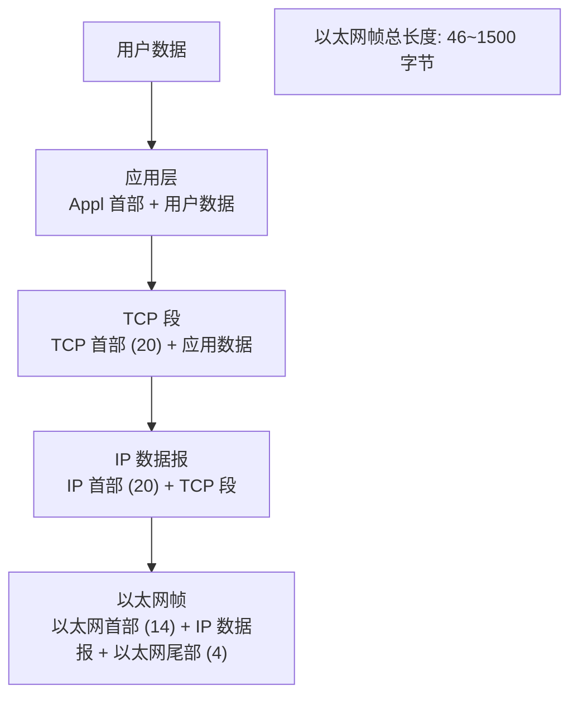

---
date:2026-6-8
tag: Web
---


# 网络的相关概念


## 网络通信

1. 概念：两台设备之间通过网络实现数据传输
2. 网络通信：将数据通过网络从一台设备传输到另一台设备
3. java.net包下提供了一系列的类或接口，供程序员使用，完成网络通讯


主机H1 - 电话网 - 路由器R1 - 局域网 - 路由器R2 -广域网 - 路由器R3 - 局域网 - 主机H2

局域网连接了路由器，使得主机H1可以通过路由器传输数据到H2


## 网络

1. 概念：两台或多台设备通过一定物理设备连接起来构成了网络
2. 根据网络的覆盖范围不同，对网络进行分类
   1. 局域网：覆盖范围最小，仅仅覆盖一个教室或机房
   2. 城域网：覆盖范围较大，可以覆盖一个城市
   3. 广域网：覆盖范围最大，可以覆盖全国甚至全球，万维网是广域网的代表


## ip

1. 概念 用于唯一标识网络中的每台计算机/ 主机
2. 查看ip地址:ipconfig
3. ip地址的表示形式: 点分十进制 xx.xx.xx.xx
4. 每一个十进制数范围:0-255
5. ip地址的组成=网络地址+主机地址,比如192.168.0.1
6. ipv6是互联网工程任务组设计的用于替代ipv4的下一代ip协议,其地址数量号称可以为全世界的每一粒沙子编上一个地址
7. 由于ipv4最大的问题在于网络地址资源有限,严重制约了互联网的应用与发展.ipv6的使用,不仅能解决网络地址资源数量的问题,也解决了多种接入设备连入互联网的障碍

ip表示:对于ipv4 的四个字节(32位)的表示

| 字节1 | 字节2 | 字节3 | 字节4 |
| ----- | ----- | ----- | ----- |
| 0-255 | 0-255 | 0-255 | 0-255 |

ipv6使用128位表示一个地址

16*8 是ipv4长度的四倍

采用16进制标识,


## 域名

1. www.baidu.com
2. 好处,为了方便记忆,解决记ip的困难
3. 概念:将ip地址映射成域名


## 端口

1. 概念: 用于标识计算机上某个特定的网络程序
2. 表示形式:以整数形式,范围0-65535
3. 0-1024已经被占用,比如ssh 22,ftp 21,smtp 25,http 80
4. 常见的网络成程序端口号
   - tomcat:8080
   - mysql:3306
   - oracle:1521
   - sqlserver:1433

当你访问 `https://example.com:8080/help` 时，浏览器会这样做：

1. **解析域名**：将 `example.com` 翻译成IP地址，比如 `93.184.216.34`。
2. **连接端口**：尝试连接该服务器的 `8080` 端口。
3. **发送请求**：在连接成功后，发送查看 `/help` 网页的请求。


**默认端口可以省略**：当你输入 `https://www.baidu.com`（没有写端口号）时，浏览器会自动使用 **443端口**（HTTPS的默认端口）。对于HTTP，则自动使用80端口。所以日常上网几乎不需要手动输入端口号。

**非标准端口必须显式写出**：如果一个网页服务运行在 `8080` 端口（不是默认的80或443），你就必须在域名后加上冒号和端口号，如：`http://example.com:8080`

| 概念       | 现实世界类比                       | 网络世界          |
| ---------- | ---------------------------------- | ----------------- |
| **域名**   | 大楼的地址（xx路88号）             | `baidu.com`       |
| **IP地址** | 大楼的地理坐标（东经xxx，北纬xxx） | `110.242.68.66`   |
| **端口**   | 大楼的房间号（101室，202室）       | `80`, `443`, `22` |

**绝大多数情况下，普通用户完全不需要手动输入端口号**，因为：

1. **默认端口被自动使用**
   浏览器访问 `http://` 开头的网址时，自动连接 **80端口**；访问 `https://` 时，自动连接 **443端口**。
   你输入 `www.baidu.com`，浏览器默默帮你补全为 `https://www.baidu.com:443`。
2. **应用程序内部已经配置好端口**
   你用Outlook收邮件、用SSH客户端连服务器、用FTP软件传文件——这些软件都已经预设了对应服务的标准端口（比如POP3是110，SSH是22）。你只需输入**域名或IP**，无需操心端口。
3. **URL中很少出现冒号加数字**
   除非访问一些**小众、测试、或家庭服务器上跑的非标准端口服务**，否则你几乎不会在网址里看到 `:8080`、`:3000` 这样的写法。


## 网络通信协议


- **协议**

  电脑和电脑之间交流的 **“共同语言”** 与 **“交通规则”**。

  TCP/IP (Transmission Control Protocol/Internet Protocol)

  中文译名为传输控制协议/因特网互联协议,又叫网络通讯协议,这个协议是internet最基本的协议

- **为什么需要？**
  你的电脑和服务器硬件不同、系统不同。没有统一规则，它们就像两个说不同方言的人，无法沟通。

- **协议规定了什么？**
  比如：数据怎么拆包、怎么寻址、出错怎么办、谁来发起对话……
  就像写信要遵守：用对方语言、写收件地址、贴邮票、放邮筒。


在网络编程中,数据的组织形式就是协议


Java简单协议演示:

```java
class Message{
    int id;
    String sender;
    String getter;
    Date sendtime;
    String content;
}
```

要使用message进行数据传输,需要填入int类型的id,等规定内容





| OSI模型                        | TCP/IP模型      | TCP/IP模型各层对应协议    |
| ------------------------------ | --------------- | ------------------------- |
| 应用层<br />表示层<br />会话层 | 应用层          | HTTP、ftp、telnet、DNS... |
| 传输层                         | 传输层（TCP）   | TCP、UDP、...             |
| 网络层                         | 网络层（IP）    | IP、ICMP、ARP...          |
| 数据链路层<br />物理层         | 物理+数据链路层 | Link                      |


## TCP 和UDP

TCP协议:传输控制协议

1. 使用TCP协议前,须先建立TCP连接,形成传输数据通道
2. 传输前,采用三次握手的方式,是可靠的
3. TCP协议进行通信的两个应用进程:客户端,服务端
4. 传输完毕,需释放已建立的连接,效率低

UDP协议:

1. 将数据 源 目的 封装成数据包,不需要建立连接
2. 每个数据包的大小限制在64K以内
3. 因无需连接,故事不可靠的
4. 发送数据结束时无需释放资源(因为不是面向连接的),速度快
5. 举例: 厕所通知:发短信


# InetAddress 类


- 相关方法
  - 1.获取本机InetAddress对象getLocalHost
  - 2.根据指定主机名/域名获取ip地址对象 getByName
  - 3.获取InetAddress对象的主机名 getHostName
  - 4.获取InetAddress对象的地址 getHostAddress


```java
package com.jl.api;

import java.net.InetAddress;
import java.net.UnknownHostException;

public class API_ {
	public static void main(String[] args) throws UnknownHostException {
//		演示InetAddress 类的使用

//		获取本机的InetAddress对象
		InetAddress localHost = InetAddress.getLocalHost();
		System.out.println(localHost);

//		根据指定的主机名获取 InetAddress 对象

		InetAddress byName = InetAddress.getByName("DESKTOP-PE6VCHN");
		System.out.println(byName);

//		根据域名返回 InetAddress 对象

		InetAddress byName1 = InetAddress.getByName("www.baidu.com");
		System.out.println(byName1);

//		通过 InetAddress 对象 反向获取对应的地址
		String hostAddress = byName1.getHostAddress();//IP
		System.out.println(hostAddress);

//		通过 InetAddress 对象 获取主机名，或者是域名
		String hostName = byName1.getHostName();
		System.out.println(hostName);


	}
}

```


# Socket


基本介绍

1. 套接字(Socket) 开发网络应用程序被广泛使用,以至于成为事实上的标准
2. 通信的两端都要有Socket,是两台机器通信的端点
3. 网络通信其实就是Socket间的通信
4. Socket允许程序把网络连接当成一个流,数据在两个Socket间通过IO流传输
5. 一般主动发起通信的应用程序属于客户端,等待通信请求的为服务端

Socket理解:

1. TCP编程,可靠
2. UDP编程,不可靠

当我们需要通讯时(读写数据)

1. socket.getOutputStream()
2. socket.getInputStream()

客户端和服务端通常情况下,是在不同的主机的.


# TCP网络通信编程

1. 基于客户端——服务端的网路通信
2. 底层使用的是TCP/IP协议
3. 应用场景举例：客户端发送数据，服务端接收并显示控制台
4. 基于Socket的TCP编程


## 应用案例1（使用字节流）

1. 编写一个服务端，和一个客户端
2. 服务器端在 9999接口监听
3. 客户端连接到服务器端，发送“hello,server”，然后退出
4. 服务器端接收到客户端发送的信息 输出 并退出


写的是两个端


### 服务端

1. 在本机的9999端口监听，等待连接
2. 当没有客户端连接9999端口时，程序会阻塞，等待连接
3. socket.getInputStream()读取客户端写入到数据通道的数据，显示数据

```java
package com.jl.socket;

import java.io.IOException;
import java.io.InputStream;
import java.net.ServerSocket;
import java.net.Socket;

public class SocketTCP01Server {
	public static void main(String[] args) throws IOException {
//		1. 在本机的9999端口监听，等待连接
//		要求在本机没有其他服务在监听9999端口
		ServerSocket serverSocket = new ServerSocket(9999);
		System.out.println("服务端在9999端口监听，等待连接...");
//      2. 当没有客户端连接9999端口时，程序会阻塞，等待连接

//		ServerSocket 可以通过serverSocket.accept() 返回多个Socket （多个客户端的并发）
		Socket socket = serverSocket.accept();
		System.out.println("服务端 socket = " + serverSocket.getClass());
//      3. socket.getInputStream()读取客户端写入到数据通道的数据，显示数据
		InputStream inputStream = socket.getInputStream();
//		IO读取
		byte[] bytes = new byte[1024];
		int readLen = 0;
		while ((readLen = inputStream.read(bytes)) != -1) {
			System.out.println(new String(bytes, 0, readLen));

		}

		inputStream.close();
		socket.close();
		serverSocket.close();
	}
}

```


### 客户端

1. 连接服务器（IP，端口）
2. 连接上后通过生成Socket 通过，socket.getOutputStream()
3. 通过输出流，写入数据到数据通道

```java
package com.jl.socket;

import java.io.IOException;
import java.io.OutputStream;
import java.net.InetAddress;
import java.net.Socket;
public class SocketTCP01Client {
	public static void main(String[] args) throws IOException {
//		1. 连接服务器（IP，端口）
//		连接 InetAddress.getLocalHost()的 9999端口，如果连接成功，返回Socket对象
		Socket socket = new Socket(InetAddress.getLocalHost(), 9999);
		System.out.println("客户端 socket返回= " + socket.getClass());
//      2. 连接上后通过生成Socket 通过，socket.getOutputStream()
//		得到和Socket关联的输出流output stream
		OutputStream outputStream = socket.getOutputStream();

//      3. 通过输出流，写入数据到数据通道
		outputStream.write("hello,server!".getBytes());
//		4. 关闭流对象和Socket
		outputStream.close();

	}
}

```


## 应用案例2（使用字节流）


1. 编写一个服务端，和一个客户端
2. 服务端在 9999端口监听
3. 客户端连接到服务器端，发送"hello,server"，并接收服务器端回发的"hello,client",再退出
4. 服务器端接收到客户端发送的信息，输出，并发送"hello,client"，再退出


### 服务端

思路分析：

1. 创建端口SocketServer
2. 创建Socket 监听Server
3. 用字节输入流接收客户端发送的信息，输出，并发送消息


```java
package com.jl.socket.TCP2;

import java.io.IOException;
import java.io.InputStream;
import java.io.OutputStream;
import java.net.ServerSocket;
import java.net.Socket;

public class SocketTCP02Server {
	public static void main(String[] args) throws IOException {
		ServerSocket serverSocket = new ServerSocket(9999);
		System.out.println("服务端在9999端口监听，等待连接...");

		Socket socket = serverSocket.accept();

		InputStream inputStream = socket.getInputStream();
		System.out.println("服务端接收到消息，准备打印...");
		byte[] bytes = new byte[1024];
		int readLen = 0;
		while ((readLen = inputStream.read(bytes)) != -1) {
			System.out.println(new String(bytes, 0, readLen));
		}
		socket.shutdownInput();
		System.out.println("打印完毕，准备输出消息");
		OutputStream outputStream = socket.getOutputStream();
		outputStream.write("hello,client".getBytes());

		System.out.println("关闭socket...关闭stream...");
		socket.shutdownOutput();
		socket.close();

		serverSocket.close();
		inputStream.close();
		outputStream.close();


	}

}

```


### 客户端

1. 创建Socket，连接到Server，
2. 创建字节流，先用输出流发送消息，
3. 再用输入流接收服务器端回发的消息（显示）（服务端3），再退出


```java
package com.jl.socket.TCP2;

import java.io.IOException;
import java.io.InputStream;
import java.io.OutputStream;
import java.net.InetAddress;
import java.net.Socket;
import java.net.UnknownHostException;

public class SocketTCP02Client {
	public static void main(String[] args) throws IOException {

		System.out.println("连接端口...");
		Socket socket = new Socket(InetAddress.getLocalHost(), 9999);

		System.out.println("输出消息...");
		OutputStream outputStream = socket.getOutputStream();
		outputStream.write("hello,server!".getBytes());

		socket.shutdownOutput();

		InputStream inputStream1 = socket.getInputStream();
		System.out.println("服务端接收到消息，准备打印...");
		byte[] bytes = new byte[1024];
		int readLen = 0;
		while ((readLen = inputStream1.read(bytes)) != -1) {
			System.out.println(new String(bytes, 0, readLen));
		}
		socket.shutdownInput();


		socket.close();
		outputStream.close();
		inputStream1.close();

	}
}

```


> socket.shutdownInput();
>
> socket.shutdownOutput();
>
> 分别代表了我说完了，我听完了，两种句号


## 应用案例3（使用字符流）


### 服务端

1. 编写服务端
2. 服务端在9999端口监听
3. 服务端接收到客户端发送的消息（客户端3）显示，并发送消息2


```java
package com.jl.socket.TCP3;

import java.io.*;
import java.net.ServerSocket;
import java.net.Socket;

public class SocketTCP02Server {
	public static void main(String[] args) throws IOException {
		ServerSocket serverSocket = new ServerSocket(9999);
		System.out.println("服务端在9999端口监听，等待连接...");

		Socket socket = serverSocket.accept();

		InputStream inputStream = socket.getInputStream();
		BufferedReader bufferedReader = new BufferedReader(new InputStreamReader(inputStream));
		System.out.println("服务端接收到消息，准备打印...");


//		byte[] bytes = new byte[1024];
//		int readLen = 0;
//		while ((readLen = inputStream.read(bytes)) != -1) {
//			System.out.println(new String(bytes, 0, readLen));
//		}
		System.out.println(bufferedReader.readLine());

		System.out.println("打印完毕，准备输出消息");
		OutputStream outputStream = socket.getOutputStream();

		BufferedWriter bufferedWriter = new BufferedWriter(new OutputStreamWriter(outputStream,"utf-8"));


//		outputStream.write("hello,client".getBytes());

		bufferedWriter.write("hello,client");
		bufferedWriter.newLine();
		bufferedWriter.flush();
		System.out.println("关闭socket...关闭stream...");
		socket.shutdownOutput();
		socket.close();

		serverSocket.close();
		inputStream.close();
		outputStream.close();
		bufferedReader.close();


	}

}

```


### 客户端

1. 编写客户端
2. 客户端连接到服务端发送hello server，（服务器3），并接收服务端发送的消息2，输出

```java
package com.jl.socket.TCP3;

import java.io.*;
import java.net.InetAddress;
import java.net.Socket;

public class SocketTCP02Client {
	public static void main(String[] args) throws IOException {

		System.out.println("连接端口...");
		Socket socket = new Socket(InetAddress.getLocalHost(), 9999);

		System.out.println("输出消息...");
		OutputStream outputStream = socket.getOutputStream();
		BufferedWriter bufferedWriter = new BufferedWriter(new OutputStreamWriter(outputStream));
//		outputStream.write("hello,server!".getBytes());
		bufferedWriter.write("hello,server！");
		bufferedWriter.newLine();
		bufferedWriter.flush();

		InputStream inputStream = socket.getInputStream();
		System.out.println("服务端接收到消息，准备打印...");
		BufferedReader bufferedReader = new BufferedReader(new InputStreamReader(inputStream));

		System.out.println(bufferedReader.readLine());
		bufferedReader.close();
//		byte[] bytes = new byte[1024];
//		int readLen = 0;
//		while ((readLen = inputStream1.read(bytes)) != -1) {
//			System.out.println(new String(bytes, 0, readLen));
//		}


		socket.close();
		outputStream.close();
		inputStream.close();

	}
}

```


> 使用newLine()来作为字符流的句号使用，除此以外，还需要刷新缓冲流flush()


## 应用案例4 文件上传:🌿


### 你真的不来看看我写了一天的自己写的没有跟老师走的写的还不错的代码吗！ 虽然他有很多冗余和不足，但是自己写出来DeepSeek给了我7分！

```markdown
# 总体评分：7/10

作为作业来说合格且良好，功能正确实现，有封装意识。如果能处理好资源关闭、异常处理，就非常完善了！继续加油 💪

```


### 服务端

1. 在9999端口监听
2. 接收到发送的图片，保存到src下，发送“收到图片”，退出


```java
package com.jl.socket.TCP4;

import java.io.*;
import java.net.ServerSocket;
import java.net.Socket;

public class SocketTCP04Server {
	public static void main(String[] args) throws IOException {

		ServerSocket serverSocket = new ServerSocket(9999);
		Socket socket = serverSocket.accept();
		StreamUtils streamUtils = new StreamUtils();
		String filePath = "D:\\JavaProject\\chapter21\\src\\END1.png";
		String line = "收到图片!";

//		输出
		streamUtils.receiveFile(socket, filePath);
		streamUtils.sendString(socket, line);


		serverSocket.close();


	}
}

```


### 客户端

1. Socket连接到服务端
2. 发送一张图片，e:\qie.png
3. 接收到“收到图片”再退出

```java
package com.jl.socket.TCP4;

import java.io.*;
import java.net.InetAddress;
import java.net.Socket;

public class SocketTCP04Client {
	public static void main(String[] args) throws IOException {
//		创建对象
		Socket socket = new Socket(InetAddress.getLocalHost(), 9999);
		StreamUtils streamUtils = new StreamUtils();
		String filePath = "E:\\JavaTest\\END1.png";
		String line = "收到图片！";
		InputStream inputStream = socket.getInputStream();

//      用于发送的路径， 这里有一个文件需要发送，
		streamUtils.sendFile(socket, filePath);
		streamUtils.receiveString(socket);

		socket.close();

	}
}

```


### StreamUtil

这个类用于封装收发消息


```java
package com.jl.socket.TCP4;

import java.io.*;
import java.net.Socket;

public class StreamUtils {


	public void sendFile(Socket socket, String filePath) throws IOException {
		//		用这个缓冲流，读取文件到缓冲流中
		OutputStream outputStream = socket.getOutputStream();
		BufferedInputStream bufferedInputStream = new BufferedInputStream(new FileInputStream(filePath));

		byte[] bytes = new byte[1024];
		int readLen = 0;
		while ((readLen = bufferedInputStream.read(bytes)) != -1) {
//		用这个发送
			outputStream.write(bytes, 0, readLen);
		}
//		发送完毕 关闭流文件
		socket.shutdownOutput();
		bufferedInputStream.close();

	}

	public void sendString(Socket socket, String line) throws IOException {
		OutputStream outputStream = socket.getOutputStream();
		BufferedWriter bufferedWriter = new BufferedWriter(new OutputStreamWriter(outputStream));
//		outputStream.write("hello,server!".getBytes());
		bufferedWriter.write(line+"\n");
		bufferedWriter.flush();
	}

	public void receiveFile(Socket socket, String filePath) throws IOException {
		//      输入文件 字节流 用于保存File内容
		BufferedOutputStream bufferedOutputStream = new BufferedOutputStream(new FileOutputStream(filePath));

		InputStream inputStream = socket.getInputStream();
		byte[] bytes = new byte[1024];
		int readLen = 0;
		while ((readLen = inputStream.read(bytes)) != -1) {

			bufferedOutputStream.write(bytes, 0, readLen);

		}
		bufferedOutputStream.close();
		socket.shutdownInput();
	}

	public void receiveString(Socket socket) throws IOException {
		InputStream inputStream = socket.getInputStream();
		BufferedReader bufferedReader = new BufferedReader(new InputStreamReader(inputStream));

		System.out.println(bufferedReader.readLine());
		bufferedReader.close();
	}

}


```


## netstat 指令

1. `netstat -an` 可以查看当前主机网络情况，包括端口监听情况和网络连接情况
2. `netstat -an|more` 可以分页显示
3. 要求在dos控制台下执行 

说明:

1. Listening 表示某个端口在监听
2. 如果有一个外部程序（客户端）连接到该端口，就会显示一条连接信息
3. 输入 `Ctrl+C` 退出命令


## TCP的秘密

1. 当客户端连接到服务端后，实际上客户端也是通过一个端口和服务端进行通讯的，这个端口是TCP/IP来分配的

2. 示意图

3. 程序验证（简单程序，不需要自己验证，不贴代码块了）

   下次再运行，也会建立一个连接，客户端的端口可能会重新分配 因为TCP是系统随机分配的


# UDP 网络通信编程【了解即可】

1.  类`DatagramSocket` 和 `DatagramPacket` 数据包/数据报 实现了基于UDP的协议网络程序
2. UDP数据报通过数据报套接字 `DatagramSocket` 发送和接收,系统不保证UDP数据报一定能够安全送到目的地,也不能确定什么时候可以抵达
3. `DatagramPacket` 对象封装了UDP数据报,在数据报中包含了发送端的IP地址和端口号以及接收端的IP地址和端口号
4. UDP协议中的每个数据报都给出了完整的地址信息,因此无需建立发送方和接收方的连接


UDP说明:

1. 没有明确的服务端和接收端,演变成数据的发送端和接收端
2. 接收数据和发送数据是通过DatagramSocket对象完成
3. 将数据封装到DatagramPacket对象 装包
4. 当接收到DatagramPacket对象 需要进行拆包 取出数据
5. datagram socket可以指定在哪个端口接收数据


## 应用案例1 :UDP发送,接收数据


### UDP Receiver


```java
package com.jl.udp;

import java.io.IOException;
import java.net.DatagramPacket;
import java.net.DatagramSocket;
import java.net.InetAddress;


public class UDPReceiverA {
	public static void main(String[] args) throws IOException {
//		1. 创建一个 DatagramSocket 对象 准备接收数据
//		   端口设置为9999
		DatagramSocket datagramSocket = new DatagramSocket(9999);
//		2. 构建一个 DatagramPacket 对象 准备接收数据
//		新建一个byte数组，一个数据报最大64k，所以数据的大小为
		byte[] bytes = new byte[64 * 1024];
//		新建数据报 但其实packet此时没有数据
		DatagramPacket datagramPacket = new DatagramPacket(bytes, bytes.length);
//		3. 调用接收方法
//		将用过网络传输的packet对象 填充到datagramPacket对象中
		System.out.println("接收端 等待接收数据...");
		datagramSocket.receive(datagramPacket);
//		当接收到对象时,需要进行拆包,取出数据. 不取出数据的话,只是一个数据包而已,里面是没有内容的
//		4. 把Packet进行拆包 取出数据 并显示

//		实际接收到的数据字节长度
		int length = datagramPacket.getLength();
//		接收到数据
		byte[] data = datagramPacket.getData();
//		输出数据到屏幕
		String s = new String(data, 0, length);
		System.out.println(s);


		//		将需要发送的对象封装到Packet对象
		bytes = "Hello,明天吃火锅!".getBytes();
//		Packet需要添加四个变量:(需要发送的对象数组,对象数组的长度,接收端的域名,接收端的端口)
		DatagramPacket datagramPacket1 = new DatagramPacket(bytes, bytes.length, InetAddress.getByName("172.20.10.9"), 9998);

		datagramSocket.send(datagramPacket1);


//		A端退出
		datagramSocket.close();


	}
}

```


### UDP Sender


```
package com.jl.udp;

import java.io.IOException;
import java.net.*;

public class UDPSenderB {
    public static void main(String[] args) throws IOException {

//     在9998上发出数据
       DatagramSocket datagramSocket = new DatagramSocket(9998);

//     将需要发送的对象封装到Packet对象
       byte[] bytes = "Hello,明天吃火锅!".getBytes();
//     Packet需要添加四个变量:(需要发送的对象数组,对象数组的长度,接收端的域名,接收端的端口)
       DatagramPacket datagramPacket = new DatagramPacket(bytes, bytes.length, InetAddress.getByName("172.20.10.9"), 9999);

       datagramSocket.send(datagramPacket);


       //    2. 构建一个 DatagramPacket 对象 准备接收数据
//     新建一个byte数组，一个数据报最大64k，所以数据的大小为
       bytes = new byte[64 * 1024];
//     新建数据报 但其实packet此时没有数据
       DatagramPacket datagramPacket1 = new DatagramPacket(bytes, bytes.length);
//     3. 调用接收方法
//     将用过网络传输的packet对象 填充到datagramPacket对象中
       System.out.println("接收端 等待接收数据...");
       datagramSocket.receive(datagramPacket1);
//     当接收到对象时,需要进行拆包,取出数据. 不取出数据的话,只是一个数据包而已,里面是没有内容的
//     4. 把Packet进行拆包 取出数据 并显示

//     实际接收到的数据字节长度
       int length = datagramPacket1.getLength();
//     接收到数据
       byte[] data = datagramPacket1.getData();
//     输出数据到屏幕
       String s = new String(data, 0, length);
       System.out.println(s);


//     B端退出
//     关闭资源
       datagramSocket.close();

    }
}
```


# 作业


## 1.编程题 Homework01.java
Homeworko1Server.java 

Homework01Client.java 

1. 使用字符流的方式，编写一个客户端程序和服务器端程序
2. 客户端发送“name”，服务器端接收到后，返回"我是nova" nova是你自己的名字.
3. 客户端发送"hobby"，服务器端接收到后，返回"编写java程序'
4. 不是这两个问题，回复"你说啥呢”


### Client

```java
package com.jl.hm;

import com.sun.security.ntlm.Server;

import java.io.*;
import java.net.InetAddress;
import java.net.ServerSocket;
import java.net.Socket;

public class Hm1Client {
	public static void main(String[] args) throws IOException {

		Socket socket = new Socket(InetAddress.getLocalHost(), 9999);
		StreamUtils streamUtils = new StreamUtils();
		String strName = "name";
		String strHobby = "hobby";
		String test = "SendTest...";
		streamUtils.sendString(socket, strName);
		streamUtils.receiveString(socket);
		streamUtils.sendString(socket, strHobby);
		streamUtils.receiveString(socket);
		streamUtils.sendString(socket, test);
		streamUtils.receiveString(socket);

		socket.close();


	}
}

```


### Server


```java
package com.jl.hm;

import java.io.BufferedInputStream;
import java.io.IOException;
import java.io.InputStream;
import java.net.ServerSocket;
import java.net.Socket;
import java.util.stream.Stream;

public class Hm1Server {
	public static void main(String[] args) throws IOException {
//		新建监听端口
		Socket socket = new Socket();
		ServerSocket serverSocket = new ServerSocket(9999);
		StreamUtils streamUtils = new StreamUtils();
		String name = "nova";
		String sendnova = "我是" + name;
		String sendhobby = "编写java程序";
		String sendwhat = "你说啥呢";

//		接收消息
		Socket accept = serverSocket.accept();
//		这个返回的是数组
//      字符流
		String s = "";
//		比较语句
		while ((s = streamUtils.receiveString(accept)) != null) {
			if (s.equals("name")) {
				streamUtils.sendString(accept, sendnova);
			} else if (s.equals("hobby")) {
				streamUtils.sendString(accept, sendhobby);
			} else {
				streamUtils.sendString(accept, sendwhat);
			}
		}
//		关闭资源
		socket.close();
		serverSocket.close();
	}
}

```


### StreamUtils

> 修改了很多程序上的bug 例如readline多次,提前关闭了Writer等


```java

package com.jl.hm;

import java.io.*;
import java.net.Socket;

public class StreamUtils {


	public void sendFile(Socket socket, String filePath) throws IOException {
		//		用这个缓冲流，读取文件到缓冲流中
		OutputStream outputStream = socket.getOutputStream();
		BufferedInputStream bufferedInputStream = new BufferedInputStream(new FileInputStream(filePath));

		byte[] bytes = new byte[1024];
		int readLen = 0;
		while ((readLen = bufferedInputStream.read(bytes)) != -1) {
//		用这个发送
			outputStream.write(bytes, 0, readLen);
		}
//		发送完毕 关闭流文件

		bufferedInputStream.close();

	}

	public void sendString(Socket socket, String line) throws IOException {
		OutputStream outputStream = socket.getOutputStream();
		BufferedWriter bufferedWriter = new BufferedWriter(new OutputStreamWriter(outputStream));
//		outputStream.write("hello,server!".getBytes());
		bufferedWriter.write(line + "\n");

		bufferedWriter.flush();
	}

	public void receiveFile(Socket socket, String filePath) throws IOException {
		//      输入文件 字节流 用于保存File内容
		BufferedOutputStream bufferedOutputStream = new BufferedOutputStream(new FileOutputStream(filePath));

		InputStream inputStream = socket.getInputStream();
		byte[] bytes = new byte[1024];
		int readLen = 0;
		while ((readLen = inputStream.read(bytes)) != -1) {

			bufferedOutputStream.write(bytes, 0, readLen);

		}
		bufferedOutputStream.flush();
	}

	public String receiveString(Socket socket) throws IOException {
		BufferedReader bufferedReader = new BufferedReader(
				new InputStreamReader(socket.getInputStream()));
		String s = bufferedReader.readLine();   // 只读一次
		System.out.println(s);
		return s;
	}

}


```


## 2.编程题 Homework02.java
ReceiverA.java

Homework02SenderB.java 

1. 编写一个接收端A和一个发送端B，使用UDP协议完成
2. 接收端在 8888端口等待接收数据(receive)
3. 发送端向接收端 发送数据"四大名著是哪些"
4. 接收端接收到发送端发送的问题后，返回"四大名著是<<红楼梦>>...” 否则返回what?
5. 接收端和发送端程序退出


### ReceiverA


```java
package com.jl.hm.hm2;

import java.io.IOException;
import java.net.DatagramPacket;
import java.net.DatagramSocket;
import java.net.InetAddress;

public class ReceiverA {
	public static void main(String[] args) throws IOException {
//		1. 创建一个 DatagramSocket 对象 准备接收数据
//		   端口设置为8888
		DatagramSocket datagramSocket = new DatagramSocket(8888);
//		2. 构建一个 DatagramPacket 对象 准备接收数据
//		新建一个byte数组，一个数据报最大64k，所以数据的大小为
		byte[] bytes = new byte[64 * 1024];
//		新建数据报 但其实packet此时没有数据
		DatagramPacket datagramPacket = new DatagramPacket(bytes, bytes.length);
//		3. 调用接收方法
//		将用过网络传输的packet对象 填充到datagramPacket对象中
		datagramSocket.receive(datagramPacket);

//		实际接收到的数据字节长度
		int length = datagramPacket.getLength();
//		接收到数据
		byte[] data = datagramPacket.getData();
//		输出数据到屏幕
		String s = new String(data, 0, length);
		String answer = "";
		if (s.equals("四大名著是哪些")) {

			answer = "四大名著是<<红楼梦>>,<<西游记>>,<<三国演义>>,<<水浒传>>";

		} else {
			answer = "what?";
		}


		//		将需要发送的对象封装到Packet对象
		bytes = answer.getBytes();
//		Packet需要添加四个变量:(需要发送的对象数组,对象数组的长度,接收端的域名,接收端的端口)
		DatagramPacket datagramPacket1 =
				new DatagramPacket(bytes, bytes.length, datagramPacket.getAddress(), datagramPacket.getPort());

		datagramSocket.send(datagramPacket1);


//		A端退出
		datagramSocket.close();

	}
}


```


### SenderB


```java
package com.jl.hm.hm2;

import java.io.IOException;
import java.net.DatagramPacket;
import java.net.DatagramSocket;
import java.net.InetAddress;
import java.util.Scanner;

public class SenderB {
	public static void main(String[] args) throws IOException {

		DatagramSocket datagramSocket = new DatagramSocket();

//		将需要发送的对象封装到Packet对象
		Scanner scanner = new Scanner(System.in);
		String answer = scanner.next();
		byte[] bytes = answer.getBytes();
//		Packet需要添加四个变量:(需要发送的对象数组,对象数组的长度,接收端的域名,接收端的端口)
		DatagramPacket datagramPacket = new DatagramPacket(bytes, bytes.length, InetAddress.getLocalHost(), 8888);

		datagramSocket.send(datagramPacket);


		//		2. 构建一个 DatagramPacket 对象 准备接收数据
//		新建一个byte数组，一个数据报最大64k，所以数据的大小为
		bytes = new byte[64 * 1024];
//		新建数据报 但其实packet此时没有数据
		DatagramPacket datagramPacket1 = new DatagramPacket(bytes, bytes.length);
//		3. 调用接收方法
//		将用过网络传输的packet对象 填充到datagramPacket对象中
		System.out.println("接收端 等待接收数据...");
		datagramSocket.receive(datagramPacket1);
//		当接收到对象时,需要进行拆包,取出数据. 不取出数据的话,只是一个数据包而已,里面是没有内容的
//		4. 把Packet进行拆包 取出数据 并显示

//		实际接收到的数据字节长度
		int length = datagramPacket1.getLength();
//		接收到数据
		byte[] data = datagramPacket1.getData();
//		输出数据到屏幕
		String s = new String(data, 0, length);
		System.out.println(s);


//		B端退出
//		关闭资源
		datagramSocket.close();

	}
}

```


> 不得不说简单题让我改成这样,我的Scanner都不知道改到哪里去了.一直没输入就已经结束了,= =


# TCP 文件下载


## Hm3Server

```java
package com.jl.hm.hm3;

import java.io.*;
import java.net.ServerSocket;
import java.net.Socket;

public class Hm3Server {
	public static void main(String[] args) throws Exception {
//		1.监听 9999 端口，等待客户连接，并读取 发送的 下载文件的名字
		ServerSocket serverSocket = new ServerSocket(9999);

//		2.等待客户端连接
		Socket socket = serverSocket.accept();
//		3.读取客户端发送的要下载的文件名
		InputStream inputStream = socket.getInputStream();
//		写入到字节数组中
//		使用while读取文件名,是考虑将来文件名比较大的情况.
		byte[] bytes = new byte[1024];
		int lens = 0;
		String downloadFilename = "";
		while ((lens = inputStream.read(bytes)) != -1) {
			downloadFilename += new String(bytes, 0, lens);

		}
		System.out.println("客户端希望下载的文件名是" + downloadFilename);

//		如果客户下载的是原色,就返回      原色.mp3
//		否则一律返回                  咖啡因乐队 - 成长的路口.mp3
		String resFilename = "";
		if ("原色".equals(downloadFilename)) {
			resFilename = "src\\原色.mp3";
		} else {
			resFilename = "src\\咖啡因乐队 - 成长的路口.mp3";
		}
//		4.开始读文件 创建一个输入流,读取文件
		BufferedInputStream bis = new BufferedInputStream(new FileInputStream(resFilename));

//		5.使用工具数组
		byte[] bytes1 = StreamUtils.streamToByteArray(bis);
//		6.得到一个socket关联的输出流
		BufferedOutputStream bos = new BufferedOutputStream(socket.getOutputStream());
//		7.写入到数据通道 返回给客户端
		bos.write(bytes1);
		bos.flush();
		socket.shutdownOutput();
		bis.close();
		inputStream.close();
		socket.close();
		serverSocket.close();
		System.out.println("服务端关闭");


	}
}

```


## Hm3Client


```java
package com.jl.hm.hm3;

import java.io.*;
import java.net.InetAddress;
import java.net.Socket;
import java.net.UnknownHostException;
import java.util.Scanner;

public class Hm3Client {
	public static void main(String[] args) throws Exception {
//		1.创建一个Scanner接收用户输入的文本
		System.out.println("服务端在9999端口监听。");
		System.out.println("请输入文本");
		Scanner scanner = new Scanner(System.in);
		String fileName = scanner.next();
//		2.客户端连接服务器,准备发送文件名称
		Socket socket = new Socket(InetAddress.getLocalHost(), 9999);
//		3.接收到的数据打入到数据通道 获取和socket关联的输出流
		OutputStream outputStream = socket.getOutputStream();
		outputStream.write(fileName.getBytes());
//		4.设置写入结束标志
		socket.shutdownOutput();

		BufferedInputStream bufferedInputStream = new BufferedInputStream(socket.getInputStream());
		byte[] bytes = StreamUtils.streamToByteArray(bufferedInputStream);

		String filePath = "E:\\" + fileName + ".mp3";
//		5.得到一个输出流,准备讲bytes内容写入到磁盘文件
//		如果下载的是原色，就是原色，
//		如果是x，那就是 咖啡因乐队 - 成长的路口
		BufferedOutputStream bos = new BufferedOutputStream(new FileOutputStream(filePath));
		bos.write(bytes);

//		6.关闭相关资源
		bufferedInputStream.close();
		bos.close();
		socket.close();
		scanner.close();


	}
}

```


## S

```java

package com.jl.hm.hm3;

import java.io.BufferedReader;
import java.io.ByteArrayOutputStream;
import java.io.InputStream;
import java.io.InputStreamReader;

public class StreamUtils {
	public static byte[] streamToByteArray(InputStream is) throws Exception {
		ByteArrayOutputStream byteArrayOutputStream = new ByteArrayOutputStream();
		byte[] bytes = new byte[1024];
		int len;
		while ((len = is.read(bytes)) != -1) {
			byteArrayOutputStream.write(bytes, 0, len);
		}
		byte[] array = byteArrayOutputStream.toByteArray();
		byteArrayOutputStream.close();
		return array;
	}

	public static String streamToString(InputStream is) throws Exception {
		BufferedReader bufferedReader = new BufferedReader(new InputStreamReader(is));
		StringBuilder stringBuilder = new StringBuilder();
		String line;
		while ((line = bufferedReader.readLine()) != null) {
			stringBuilder.append(line + "\r\n");

		}
		return stringBuilder.toString();
	}
}

```

